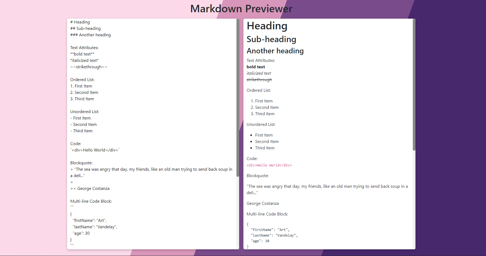

# Markdown Previewer 📄

## Description

A responsive **React Markdown Previewer** app which contains a textarea for Markdown input and a preview tab where the converted text will appear.

A FreeCodeCamp Front End Development Libraries project, with the objective to fulfill the user stories and get all of the tests to pass.

## Built With

## Dependencies 

[Marked](https://marked.js.org/) - Markdown Parser 

## Snapshot 

## Link 

[Markdown Previewer](https://react-app-markdown-previewer.netlify.app/)

## User Stories

~~~~~~
User Story #1: I can see a textarea element with a corresponding id="editor".

User Story #2: I can see an element with a corresponding id="preview".

User Story #3: When I enter text into the #editor element, the #preview element is updated as I type to display the content of the textarea.

User Story #4: When I enter GitHub flavored markdown into the #editor element, the text is rendered as HTML in the #preview element as I type.

User Story #5: When my markdown previewer first loads, the default text in the #editor field should contain valid markdown that represents at least one of each of the following elements: a heading element (H1 size), a sub heading element (H2 size), a link, inline code, a code block, a list item, a blockquote, an image, and bolded text.

User Story #6: When my markdown previewer first loads, the default markdown in the #editor field should be rendered as HTML in the #preview element.
~~~~~~

## Credits
Favicon from: 
[freepik](https://www.freepik.com/)

Background Image from: 
[Gradienta](https://unsplash.com/@gradienta?utm_source=unsplash&utm_medium=referral&utm_content=creditCopyText) on [Uplash](https://unsplash.com/collections/11403159/abstract?utm_source=unsplash&utm_medium=referral&utm_content=creditCopyText)

## License

Licensed under the MIT license.

## Questions 💬

[Email Me](Chloe.a.harris17@gmail.com) if you have any questions.

Check out more of my work on [GitHub](https://github.com/chloeharris1).
